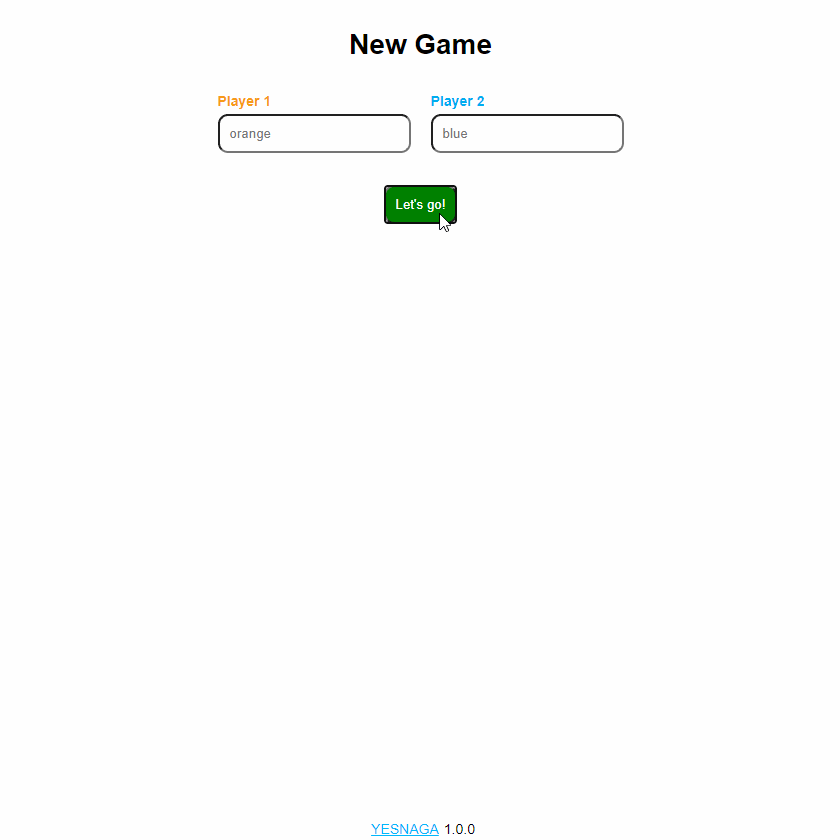

  

# YESNAGA

## About
Yesnaga is inspired by Nonaga, a board game created by [Viktor Bautista i Roca](https://twitter.com/viktorbir) and distributed by Steffen Spiele.

The game has a hexagonal playing area composed of 19 discs, with each player having three moveable tokens, that start in alternating vertices around the hexagon. Every turn, a player must do two things, in order:

- Move one of their tokens in a straight line up to the end of the board or up to colliding with another token
- Move one of the exterior empty discs to another location on the playing area where it touches at least two discs.

Whoever first manages to connect their three tokens wins!

## Getting started

You have two options to play Yesnaga

- Visit [yesnaga.parnswir.de](https://yesnaga.parnswir.de)

OR

- Run it locally on your computer following these simple steps:

1. Make sure you have [Nodejs](https://nodejs.org/) installed
2. `$ git clone https://github.com/yesnaga/yesnaga.git && cd yesnaga`
3. `$ npm i && npm run start`
4. Open http://localhost:3000 to play local multiplayer

### Running tests

`$ npm i && npm test`

## License

Distributed under the GNU General Public License v3.0. See [LICENSE](./LICENSE) for more information.

## Contact

Created with 💙 by [Tor](https://github.com/Ojself) and [Max](https://github.com/Parnswir) in their free time. Don't be too hard on them.
